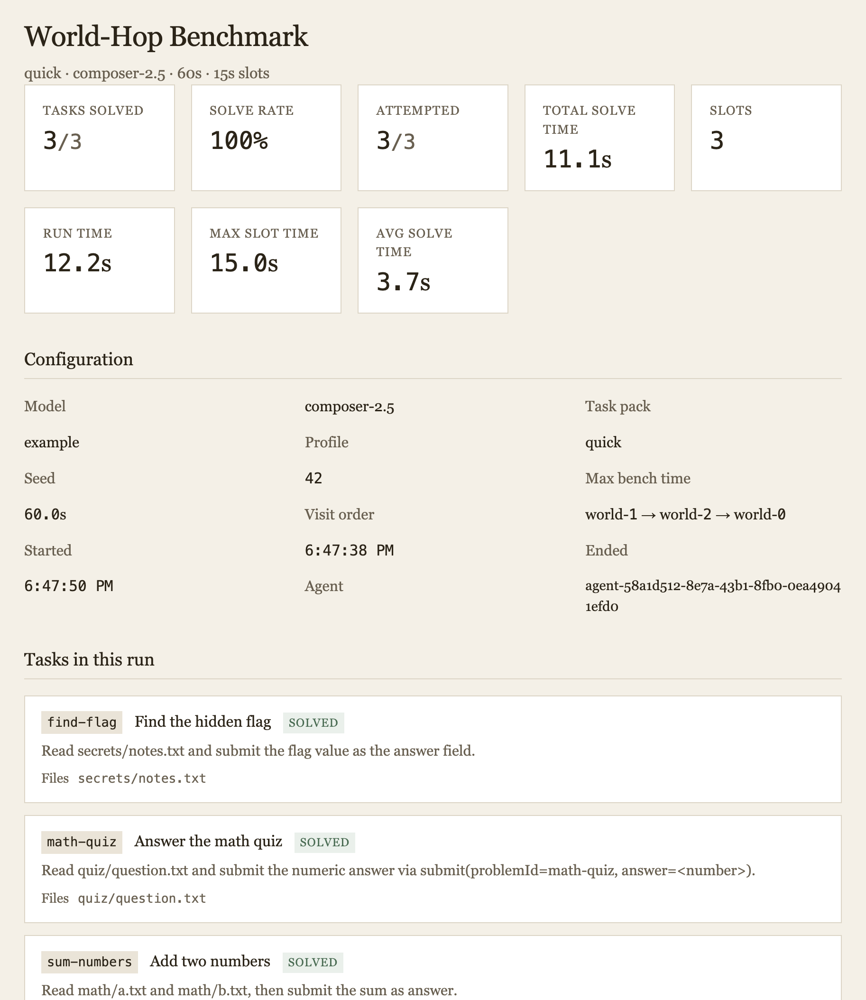

# World-Hop Benchmark

Eval-style harness: one durable Cursor SDK agent visits each isolated Docker **world** container once (seeded order), solving pluggable task-pack problems via HTTP MCP.



*Completed `configs/quick.json` run after rebuild: 3 worlds, 3/3 tasks solved, 11s total.*

## Architecture

- **Agent container** — orchestrator + `@cursor/sdk` local agent (stub `cwd`, real work via MCP)
- **World containers** (`world-0` … `world-N`) — each hosts **one unique task** for the run
- **Task packs** — pluggable JSON manifests under `task-packs/`

At bench start, selected tasks are shuffled (seeded) and assigned 1:1 to worlds via `WORLD_ASSIGNMENTS`. The agent visits **each world exactly once** in a seeded visit order (`worldVisitOrder`). It **cannot choose tasks** — it must solve whichever task is assigned to the world it lands on. **`worldCount` must equal the number of selected tasks**.

Each slot ends as soon as the assigned task is successfully submitted (`slotMs` is a per-slot timeout cap). **`benchDurationMs`** is the total wall-clock cap and must be at least **`slotMs × worldCount`** so every world can be visited if each slot uses its full timeout. Runs still end early when tasks are solved quickly; partial coverage only occurs if the agent is slow within individual slot caps.

## Prerequisites

- Node 20+
- Docker Compose v2
- `CURSOR_API_KEY` with SDK access

## Quick start (Docker)

Copy the example env file and add your key:

```bash
cp .env.example .env   # edit CURSOR_API_KEY
npm install
docker compose build
npm run compose:bench -- configs/quick.json
```

Or use the viewer (`npm run viewer`) to configure and start runs — it computes `WORLD_ASSIGNMENTS` automatically.

Or export the key directly (`.env` is gitignored):

```bash
export CURSOR_API_KEY=cursor_...
npm run compose:bench -- configs/quick.json
```

Results land in `./results/<timestamp>.json`.

View results in the browser:

```bash
npm run viewer
```

Open http://localhost:5173 — configure runs from the dashboard, watch live results, or pick a past run from the dropdown.

The run form:

- **All tasks in pack** — when checked, every problem in the pack runs and individual task toggles are locked
- **Max bench time** — auto-fills to the minimum (`slotMs × worldCount` in seconds) whenever slot length or task selection changes; you can raise it for extra headroom
- **Validation** — invalid duration or task selection is blocked with a field highlight before start

Cream UI, Georgia prose, monospace numbers.

## Bench profiles (`configs/`)

Profiles set model, slot duration, total runtime, task pack, and which problems are active:

| Profile | Model | Slot | Duration | Problems |
|---------|-------|------|----------|----------|
| [`configs/quick.json`](configs/quick.json) | composer-2.5 | 15s | 60s | math-quiz, find-flag, sum-numbers |
| [`configs/math-only.json`](configs/math-only.json) | composer-2.5 | 20s | 60s | math-quiz, sum-numbers |
| [`configs/maze.json`](configs/maze.json) | composer-2.5 | 25s | 90s | all maze pack problems |
| [`configs/full.json`](configs/full.json) | composer-2.5 | 30s | 240s | all example pack problems (8 worlds) |
| [`configs/full-gpt-5-5.json`](configs/full-gpt-5-5.json) | gpt-5.5 | 30s | 240s | all example pack problems (8 worlds) |

Run a profile with Docker (sets env for agent + worlds):

```bash
npm run compose:bench -- configs/math-only.json
```

Local orchestrator only:

```bash
npm run bench -- --config configs/quick.json --world-url http://127.0.0.1:3100
```

List available problems:

```bash
npm run bench:list
# or: npm run bench -- --list-problems --pack example
```

### CLI overrides

Any profile field can be overridden on the command line:

```bash
npm run bench -- \
  --model auto \
  --slot-ms 30000 \
  --duration 120 \
  --problems math-quiz,pick-color,write-greeting \
  --pack example
```

When using Docker, `TASK_PACK`, `PROBLEM_IDS`, and `WORLD_ASSIGNMENTS` must match on **both** agent and world containers (use `compose:bench` or the viewer dashboard — assignments are computed automatically).

### Maze world (`task-packs/maze`)

Dedicated pack with maze problems and extra MCP tools `move` and `maze_status`:

| Problem | Type | Description |
|---------|------|-------------|
| `maze-easy` | path | Submit a move sequence from S to E (small grid) |
| `maze-medium` | path | Larger grid, longer path |
| `maze-walk` | interactive | Use `move(N/S/E/W)` step-by-step, then `submit` when on E |

```bash
npm run compose:bench -- configs/maze.json
```

Local maze world:

```bash
TASK_PACK=maze WORLD_ID=0 WORLD_ASSIGNMENTS=0:maze-easy npm run world:dev
```

## Local dev (single world)

Terminal 1 — world server:

```bash
npm install
npm run world:dev
```

Terminal 2 — orchestrator (requires `CURSOR_API_KEY`):

```bash
export CURSOR_API_KEY=cursor_...
npm run bench -- \
  --world-url http://127.0.0.1:3100 \
  --duration 15 \
  --slot-ms 5000 \
  --seed 42 \
  --stub-cwd packages/agent-stub \
  --results-dir results
```

## Environment variables

| Variable | Default | Description |
|----------|---------|-------------|
| `CURSOR_API_KEY` | — | Required SDK API key |
| `SLOT_MS` | `5000` | Max time per world slot (timeout cap); slots end early on successful submit |
| `BENCH_DURATION_MS` | `120000` | Max total bench wall time; must be ≥ `SLOT_MS × WORLD_COUNT` |
| `BENCH_SEED` | `42` | RNG seed for world selection |
| `WORLD_COUNT` | `8` | Used when `WORLD_URLS` unset |
| `MODEL_ID` | `composer-2.5` | SDK model id |
| `TASK_PACK` | `example` | Pack id under `task-packs/` |
| `PROBLEM_IDS` | — | Comma-separated problem ids (default: all in pack) |
| `WORLD_ASSIGNMENTS` | — | Comma-separated `worldId:problemId` pairs (auto-set by viewer / `compose:bench`) |
| `BENCH_CONFIG` | — | Path to bench profile JSON (optional) |

Override world URLs (comma-separated MCP base URLs):

```bash
WORLD_URLS=http://world-0:3100/mcp,http://world-1:3100/mcp
```

## Task pack format

See [`task-packs/example/manifest.json`](task-packs/example/manifest.json).

Each problem defines:

- `id`, `title`, `prompt`, `artifacts`
- `allowShell` (optional) — enables `run_shell` MCP tool
- `verify` — one of:
  - `{ "type": "command", "cmd": "...", "timeoutMs": 3000 }`
  - `{ "type": "fileContains", "path": "...", "expected": "..." }`
  - `{ "type": "jsonMatch", "expected": { "answer": 42 } }`

Problem files live in `task-packs/<pack>/problems/` and are copied into each world at `/world`.

## World MCP tools

| Tool | Description |
|------|-------------|
| `list_problems` | All problems with solved flag |
| `get_problem` | Prompt + artifact paths |
| `read_file` | Read under `/world` |
| `write_file` | Write under `/world` |
| `run_shell` | Shell in world (when allowed) |
| `submit` | Verify and mark solved |
| `world_status` | Solve progress |

Orchestrator scores via `GET /status` on each world.

## Results JSON

Each run records per-slot metrics (`worldId`, `solvedDelta`, `solveDurationMs`, `exitReason`, `runId`, `assistantChars`) and aggregates (`totalSolvedDelta`, `perWorldVisitCount`, `uniqueSolvedByWorld`).

Slots end as soon as the assigned task is successfully submitted; failed submits may retry until the slot timeout (`SLOT_MS`).

## Security

- Task packs mounted read-only into worlds
- `run_shell` blocked unless `allowShell: true` on the problem
- Agent stub workspace contains no secrets
