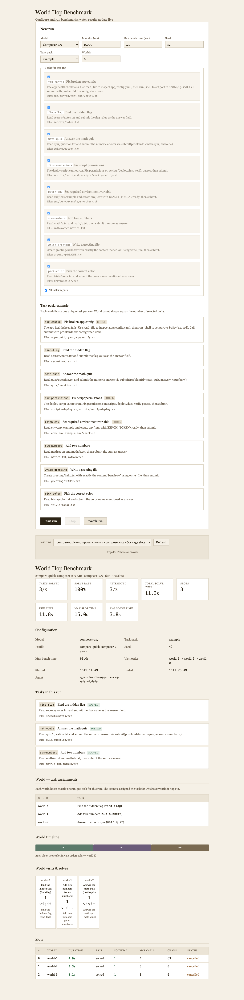
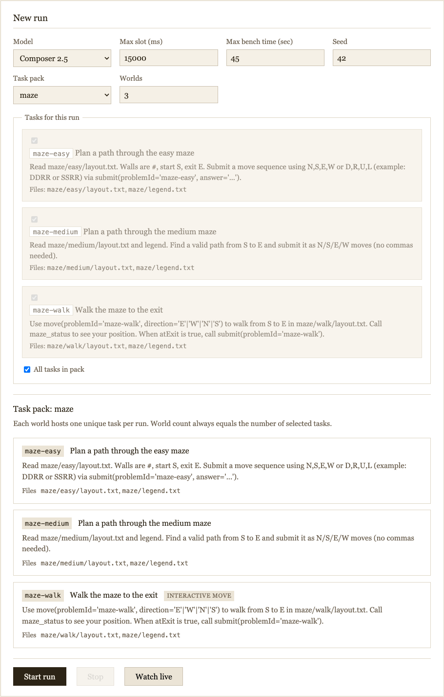
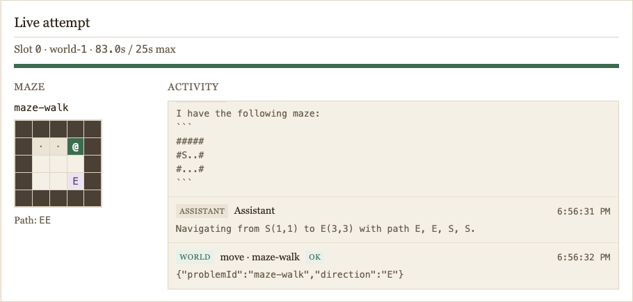

# World Hop Benchmark

**One Cursor SDK agent. Many isolated Docker worlds. One visit each—solve the task, then hop.**

Eval-style harness for comparing models on real tool use: the agent connects to a single world per slot via HTTP MCP, cannot browse your repo, and must submit verified solutions before the orchestrator moves on.

---

## Model comparison at a glance

Four models · three suites · three seeds each (`42`, `43`, `44`) · **36 runs** total ([full report](docs/MODEL_COMPARISON.md), June 2026).

| Model | Quick (3 example tasks) | Maze (3 maze tasks) | Full (8 example tasks) |
|-------|-------------------------|---------------------|------------------------|
| **Composer 2.5** | 100% solve · **12s** median · flawless 3/3 seeds | 67% solve · **32s** · misses `maze-medium` every seed | 100% · **39s** · flawless 3/3 |
| **GPT 5.5** | 100% · 33s · flawless 3/3 | **100%** · 49s · **only model flawless on maze** | 100% · 94s · flawless 3/3 |
| **Opus 4.7** | 100% · 25s · flawless 3/3 | 89% · 53s · `maze-walk` timeout on seed 42 | 96% · 96s · one miss on seed 42 (7/8) |
| **Opus 4.8** | 100% · 34s · flawless 3/3 | 78% · 61s · `maze-walk` timeouts on seeds 42–43 | 96% · 96s · one miss on seed 42 (7/8) |

**Flawless 3/3 seeds** = all three runs solved every assigned task. **Maze** and **full** are different packs—`full` does not include maze.

**Headline:** Composer is **fastest** everywhere but **never** gets 3/3 on maze (`maze-medium`, one-shot path). GPT is **slower** but **reliable on maze**. Opus is strong on quick, weaker on interactive `maze-walk` (step-by-step `move`) and occasional full-pack slips.

```bash
npm run compare:models      # re-run sweep
npm run compare:summarize   # refresh docs/MODEL_COMPARISON.md
```

---

## What you get



*Viewer after a quick run: Composer 2.5, 3/3 tasks, ~12s wall time.*

The browser UI at [http://localhost:5173](http://localhost:5173) is the control surface:

| View | Screenshot | What it shows |
|------|------------|---------------|
| **Results** | [viewer-results.png](docs/images/viewer-results.png) | Stats, visit-order timeline, per-slot outcomes |
| **New run** | [viewer-dashboard.png](docs/images/viewer-dashboard.png) | Model, timing, task pack, task selection, validation |
| **Live maze** | [viewer-maze-live.png](docs/images/viewer-maze-live.png) | Grid + path trail + MCP activity during `maze-walk` |



```bash
npm run viewer
```

Use **Start run** for Docker benches, **Watch live** during a run, or pick a past result from the dropdown.



---

## Quick start (Docker)

```bash
cp .env.example .env   # add CURSOR_API_KEY
npm install
docker compose build
npm run compose:bench -- configs/quick.json
```

Or start from the [viewer dashboard](docs/images/viewer-dashboard.png) (`npm run viewer`)—assignments are computed automatically.

Results land in `./results/<timestamp>.json`.

---

## Architecture

- **Agent container** — orchestrator + `@cursor/sdk` local agent (stub `cwd`, real work via MCP)
- **World containers** (`world-0` … `world-N`) — each hosts **one unique task** for the run
- **Task packs** — pluggable JSON manifests under `task-packs/`

### Cursor Agent SDK, not chat completion

This benchmark does **not** call a raw chat-completions API or maintain its own `messages[]` tool loop. The orchestrator uses **`@cursor/sdk`’s `Agent` harness**:

1. **`Agent.create`** — one durable agent for the whole run (local `cwd` = [`packages/agent-stub`](packages/agent-stub); tasks are not solved in that tree).
2. **`agent.send(prompt, { mcpServers })`** — each world visit starts a new SDK **`Run`** with the `world` HTTP MCP server attached for that slot only.
3. **`run.stream()`** — the harness drives the model/tool loop; the orchestrator only consumes events (assistant text, thinking, MCP tool calls) for the live viewer and metrics.
4. **`run.cancel()`** — when a task is solved early or the slot times out, the orchestrator stops the run; SDK status may read `cancelled` even when the bench records `exitReason: solved`.

Work happens in world containers via MCP (`get_problem`, `read_file`, `submit`, maze `move`, etc.). Cursor hooks in the stub workspace **deny** local `read`/`write`/`shell` tools so the agent is pushed toward world MCP only (see [`packages/agent-stub/.cursor/hooks/mcp-only.js`](packages/agent-stub/.cursor/hooks/mcp-only.js)).

That is the same **programmatic agent runtime** Cursor exposes for SDK/CLI agents—not the IDE chat panel, and not a hand-rolled OpenAI-style completion client. Scoring still comes from each world’s HTTP `/status`, not from parsing the model’s final message.

At bench start, selected tasks are shuffled (seeded) and assigned 1:1 to worlds via `WORLD_ASSIGNMENTS`. The agent visits **each world exactly once** in a seeded visit order (`worldVisitOrder`). It **cannot choose tasks**—it must solve whichever task is assigned to the world it lands on. **`worldCount` must equal the number of selected tasks**.

Each slot ends as soon as the assigned task is successfully submitted (`slotMs` is a per-slot timeout cap). **`benchDurationMs`** is the total wall-clock cap and must be at least **`slotMs × worldCount`** so every world can be visited if each slot uses its full timeout. Runs still end early when tasks are solved quickly; partial coverage only occurs if the agent is slow within individual slot caps.

---

## Prerequisites

- Node 20+
- Docker Compose v2
- `CURSOR_API_KEY` with SDK access

---

## Multi-model comparison (detail)

Suites and configs:

| Suite | Config | Pack | Tasks |
|-------|--------|------|-------|
| **quick** | [`configs/quick.json`](configs/quick.json) | `example` | 3 of 8 (`math-quiz`, `find-flag`, `sum-numbers`) |
| **maze** | [`configs/maze.json`](configs/maze.json) | `maze` | `maze-easy`, `maze-medium`, `maze-walk` |
| **full** | [`configs/full.json`](configs/full.json) | `example` | all 8 example tasks |

**Maze task styles** (failures cluster by style):

| Task | Style | Agent workflow |
|------|--------|----------------|
| `maze-easy` | Path in one shot | Read layout → `submit(..., answer='NSEW…')` |
| `maze-medium` | Path in one shot (larger) | Same; Composer missed on **every** seed |
| `maze-walk` | Step-by-step | `move` + `maze_status` → `submit` at exit; Opus often hit **25s slot timeout** |

Per-model, per-seed tables and raw JSON paths: **[docs/MODEL_COMPARISON.md](docs/MODEL_COMPARISON.md)**.

Sweep flags: `--dry-run`, `--only quick`, `--only-model gpt-5.5`, `--from-run 12`, `--sleep-ms 5000`, `--no-build`.

---

## Maze world (`task-packs/maze`)

Dedicated pack with extra MCP tools `move` and `maze_status`. See the [live maze screenshot](docs/images/viewer-maze-live.png) above.

| Problem | Type | Description |
|---------|------|-------------|
| `maze-easy` | path | Submit a move sequence from S to E (small grid) |
| `maze-medium` | path | Larger grid, longer path |
| `maze-walk` | interactive | Use `move(N/S/E/W)` step-by-step, then `submit` when on E |

```bash
npm run compose:bench -- configs/maze.json
```

Local maze world:

```bash
TASK_PACK=maze WORLD_ID=0 WORLD_ASSIGNMENTS=0:maze-easy npm run world:dev
```

---

## CLI overrides

Any profile field can be overridden on the command line:

```bash
npm run bench -- \
  --model auto \
  --slot-ms 30000 \
  --duration 120 \
  --problems math-quiz,pick-color,write-greeting \
  --pack example
```

When using Docker, `TASK_PACK`, `PROBLEM_IDS`, and `WORLD_ASSIGNMENTS` must match on **both** agent and world containers (use `compose:bench` or the viewer dashboard).

List available problems:

```bash
npm run bench:list
# or: npm run bench -- --list-problems --pack example
```

---

## Local dev (single world)

Terminal 1 — world server:

```bash
npm install
npm run world:dev
```

Terminal 2 — orchestrator (requires `CURSOR_API_KEY`):

```bash
export CURSOR_API_KEY=cursor_...
npm run bench -- \
  --world-url http://127.0.0.1:3100 \
  --duration 15 \
  --slot-ms 5000 \
  --seed 42 \
  --stub-cwd packages/agent-stub \
  --results-dir results
```

---

## Environment variables

| Variable | Default | Description |
|----------|---------|-------------|
| `CURSOR_API_KEY` | — | Required SDK API key |
| `SLOT_MS` | `5000` | Max time per world slot (timeout cap); slots end early on successful submit |
| `BENCH_DURATION_MS` | `120000` | Max total bench wall time; must be ≥ `SLOT_MS × WORLD_COUNT` |
| `BENCH_SEED` | `42` | RNG seed for world selection |
| `WORLD_COUNT` | `8` | Used when `WORLD_URLS` unset |
| `MODEL_ID` | `composer-2.5` | SDK model id |
| `TASK_PACK` | `example` | Pack id under `task-packs/` |
| `PROBLEM_IDS` | — | Comma-separated problem ids (default: all in pack) |
| `WORLD_ASSIGNMENTS` | — | Comma-separated `worldId:problemId` pairs (auto-set by viewer / `compose:bench`) |
| `BENCH_CONFIG` | — | Path to bench profile JSON (optional) |

Override world URLs (comma-separated MCP base URLs):

```bash
WORLD_URLS=http://world-0:3100/mcp,http://world-1:3100/mcp
```

---

## Task pack format

See [`task-packs/example/manifest.json`](task-packs/example/manifest.json).

Each problem defines:

- `id`, `title`, `prompt`, `artifacts`
- `allowShell` (optional) — enables `run_shell` MCP tool
- `verify` — one of:
  - `{ "type": "command", "cmd": "...", "timeoutMs": 3000 }`
  - `{ "type": "fileContains", "path": "...", "expected": "..." }`
  - `{ "type": "jsonMatch", "expected": { "answer": 42 } }`

Problem files live in `task-packs/<pack>/problems/` and are copied into each world at `/world`.

---

## World MCP tools

| Tool | Description |
|------|-------------|
| `list_problems` | All problems with solved flag |
| `get_problem` | Prompt + artifact paths |
| `read_file` | Read under `/world` |
| `write_file` | Write under `/world` |
| `run_shell` | Shell in world (when allowed) |
| `submit` | Verify and mark solved |
| `world_status` | Solve progress |

Orchestrator scores via `GET /status` on each world.

---

## Results JSON

Each run records per-slot metrics (`worldId`, `solvedDelta`, `solveDurationMs`, `exitReason`, `runId`, `assistantChars`) and aggregates (`totalSolvedDelta`, `perWorldVisitCount`, `uniqueSolvedByWorld`).

Slots end as soon as the assigned task is successfully submitted; failed submits may retry until the slot timeout (`SLOT_MS`).

---

## Security

- Task packs mounted read-only into worlds
- `run_shell` blocked unless `allowShell: true` on the problem
- Agent stub workspace contains no secrets
