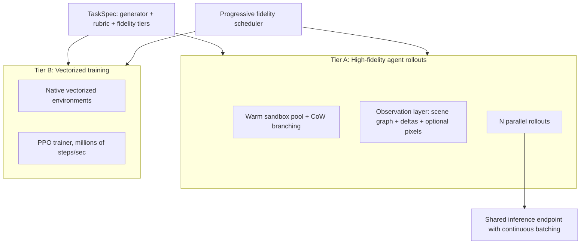

# RL Gym Design: A Dual-Tier Architecture

This document describes the architecture of a reinforcement learning gym for
training and evaluating agents, and the state-of-the-art approaches it builds
on in each of the areas that matter: throughput, isolation, observations,
randomization, verification, and training.

The core framing: **an RL environment and an agent eval are the same
abstraction** — a dataset of tasks, a harness the agent acts through, and a
rubric that scores the outcome. One task definition serves both training and
evaluation.

## 1. Two regimes, one task spec

Agent workloads fall into two regimes with incompatible performance
characteristics, so the gym is split into two tiers that share a single task
specification:

- **Tier A — High-fidelity agent tier** (LLM-in-the-loop, ~seconds/step).
  Real software running in isolated sandboxes; the agent acts through tools.
  Throughput comes from *concurrency* — many parallel rollouts feeding a
  continuously-batched inference server — and *fast resets* via snapshot and
  copy-on-write branching, not from making the environment itself faster.
- **Tier B — High-throughput training tier** (1M+ steps/sec). Vectorized
  native (C/CUDA) environments with small policies, asynchronous on-policy
  sampling, and shared-memory transport. Modern vectorized RL frameworks such
  as PufferLib reach 2–4M end-to-end training steps/sec on a single consumer
  GPU; the gym integrates with them rather than reimplementing them.

Each **TaskSpec** declares a parametric generator (for randomization), a
scoring rubric, and one implementation per fidelity tier: a native vectorized
low-fidelity environment for Tier B and a containerized high-fidelity
environment for Tier A. Policies and curricula are screened cheaply in Tier B;
agents are evaluated and fine-tuned at full fidelity in Tier A.

## 2. Standard environment interface

Environments expose a Gymnasium-style `step()` / `reset()` / `state()` API
over HTTP, packaged as containers, with tools exposed via the Model Context
Protocol (MCP). This follows the OpenEnv specification, the emerging open
standard for agentic execution environments.

- **Agent-agnostic**: any model or harness drives the gym through an
  OpenAI-compatible endpoint. The gym owns the environment, tools, and
  scoring — never the agent.
- **Schema-validated task manifests**: Zod on the TypeScript side, Pydantic on
  the Python side, so task packs fail fast at load time instead of drifting
  silently.
- **Exhaustively-typed verifiers**: discriminated unions with `never`-checked
  switches so new verifier types cannot ship unhandled.

## 3. Throughput in the agent tier

### Parallel rollouts and continuous batching

The single largest throughput lever is running N rollouts concurrently.
Inference servers (vLLM, SGLang) implement *continuous batching*: requests
join and leave the GPU batch at token granularity, so utilization stays high
as long as the request queue is full. The gym's job is to keep that queue
full — concurrency in the rollout scheduler is what converts batching capacity
into real throughput. Prefix caching across rollouts that share system
prompts and tool schemas compounds the win.

### Fast resets: snapshot/restore with copy-on-write branching

Cold-booting a sandbox per episode wastes minutes; the state of the art is
snapshot/restore with copy-on-write (CoW) branching:

1. **File-tree snapshots** (overlayfs/tmpfs): restore the environment's
   working directory in milliseconds. Simplest, covers file-based tasks.
2. **Process-tree checkpoints** (CRIU): checkpoint and restore running
   processes, preserving in-memory state.
3. **MicroVM memory snapshots** (Firecracker): snapshot a full VM — memory,
   vCPU, and device state — then restore in tens of milliseconds by
   memory-mapping the snapshot. CoW page sharing (`mmap MAP_PRIVATE`) lets
   dozens of branches share a warm parent's resident memory until they
   diverge, so a single pre-warmed parent fans out into N children at
   near-zero marginal cost.

Branching is a first-class primitive, not just a reset mechanism: forking a
*running* environment mid-episode into N branches enables tree-style rollout
algorithms (GRPO, best-of-N, MCTS-style search). Branch hygiene is mandatory —
on every fork, guest entropy is re-seeded and identities, tokens, and session
state are rotated so branches do not share PRNG streams or credentials.

The same snapshotting idea extends to the inference side: forking an
engine's KV cache alongside the environment collapses per-branch prefill cost
to a memory copy.

### Warm pools and elastic orchestration

A pool manager pre-warms sandboxes ahead of demand and hands them out per
rollout. Isolation for untrusted, model-generated code uses microVMs
(Firecracker) or syscall-filtering sandboxes (gVisor) rather than plain
containers. Orchestration is elastic (Kubernetes-class scheduling), not a
fixed set of statically-declared services.

### Progressive fidelity scheduling

Evaluation and hyperparameter sweeps use successive halving (Hyperband-style):
a cheap screening pass — short budgets, smaller models, low-fidelity
observations — runs across the full task/config matrix, and only survivors are
promoted to full-budget, high-fidelity runs. This concentrates expensive
compute where it changes the outcome.

## 4. Observations

### Structured scene state with incremental deltas

Each environment maintains a structured scene representation — file tree,
viewport, UI state — and responses return only the *diff* since the last
observation plus stable hashes of unchanged regions, with full snapshots
cached server-side. This borrows the virtual-DOM model: swap only the region
that changed, reuse everything else. It cuts tokens dramatically on long
episodes and keeps the agent's context focused on what moved.

### Hybrid vision, not flat matrices

Environments are never reduced to flat matrices. For GUI and spatial tasks,
the empirical state of the art is *hybrid* observation: a rendered screenshot
combined with a structured accessibility tree outperforms either modality
alone. Compressed accessibility-tree representations cut input tokens to
roughly a fifth of the raw tree while *improving* task success; visual
overlay schemes such as Set-of-Marks help some models but produce
inconsistent results overall. The gym therefore treats the structured scene
graph (tokenized viewports, hashed regions and their bounding boxes) as the
primary channel, with rendered pixels as an optional secondary channel for
vision models.

## 5. Anti-memorization: domain randomization

Static tasks teach coordinates; randomized tasks teach strategy. Every task
pack is a *parametric generator*: layouts, file names, ports, identifiers,
and values are generated per seed, and verifiers check **properties, not
constants**. An agent that learned to click a pixel fails immediately; an
agent that learned to operate the interface generalizes. Generation is
deterministic per seed, so comparisons across models remain fair, and
held-out generator configurations provide uncontaminated test splits.

## 6. Verification and reward quality

Reward signal quality is the gym's most important property — false positives
in verification poison both evals and training.

- **Graded rubrics**: scored rubrics (partial credit, step efficiency,
  constraint adherence) rather than binary pass/fail, providing usable RL
  reward signals.
- **Layered verification**: execution-based checks (run the artifact, observe
  behavior) as the backbone; rubric ensembles and calibrated LLM judges where
  execution alone is insufficient.
- **Verifier QA as a measured discipline**: verifier precision and recall are
  measured against human labels, and verifiers are adversarially red-teamed
  for reward hacking before tasks ship.
- **Task generation at scale**: parametric, LLM-assisted task generation with
  human QA and held-out splits grows the corpus from dozens of tasks to
  thousands without sacrificing verification quality.

## 7. Vectorized training tier

The high-throughput tier hosts native vectorized implementations of
environments (grid worlds first) driven by an asynchronous PPO trainer.
The techniques that make millions of steps per second possible:

- Environments written in C/CUDA, compiled to native code.
- Zero-copy shared-memory transport between environment workers and the
  trainer.
- Asynchronous on-policy sampling: while the policy computes actions for one
  batch of environments, another batch steps in the background, eliminating
  simulation downtime.
- Autotuned vectorization parameters (worker count, batch size, zero-copy
  mode) per environment and host.

This tier exists because LLM-in-the-loop rollouts cannot exceed inference
latency; small-policy training and curriculum generation belong here, with
results transferred to the agent tier for high-fidelity evaluation.

## 8. Trajectories and observability

Every rollout produces a replayable trace: observations, actions, tool calls,
environment diffs, and rubric scores. Traces support failure taxonomies for
debugging, human baselines for calibration, and export as SFT or preference
datasets — the trajectory data is a product of the gym, not a byproduct.

## 9. Glossary

| Term | Meaning |
| --- | --- |
| Continuous batching | Inference-server scheduling where requests join/leave the GPU batch at token granularity (vLLM, SGLang). |
| CoW branching | Forking an environment from a snapshot using copy-on-write memory so branches share pages until they diverge. |
| Domain randomization | Per-seed parametric generation of task surfaces so agents learn strategy, not coordinates. |
| Incremental observations | Returning only the changed region of the environment plus hashes of unchanged regions (virtual-DOM-style diffing). |
| MicroVM | Minimal virtual machine (e.g. Firecracker) giving VM-grade isolation with container-like startup via paravirtualized (virtio) devices. |
| Progressive fidelity | Cheap low-fidelity screening passes followed by promotion of survivors to high-fidelity runs (successive halving / Hyperband). |
| Rubric | A set of scoring functions evaluated against a rollout, producing scalar rewards. |
| Set-of-Marks | Overlaying numbered bounding boxes on screenshots to aid visual grounding. |
| Successive halving | Allocating budget in rounds, discarding the worst-performing fraction each round. |
| Verifier | An executable correctness check for a task submission. |

## 10. References

- OpenEnv specification (Gymnasium-style agentic environments):
  <https://github.com/meta-pytorch/OpenEnv>
- PufferLib (vectorized high-throughput RL): <https://github.com/pufferai/pufferlib>
- Firecracker microVM snapshots:
  <https://github.com/firecracker-microvm/firecracker/blob/main/docs/snapshotting/snapshot-support.md>
- vLLM (continuous batching, prefix caching): <https://github.com/vllm-project/vllm>
- CRIU (checkpoint/restore in userspace): <https://criu.org>
- GUI-agent observation-modality literature:
  <https://github.com/OSU-NLP-Group/GUI-Agents-Paper-List>
