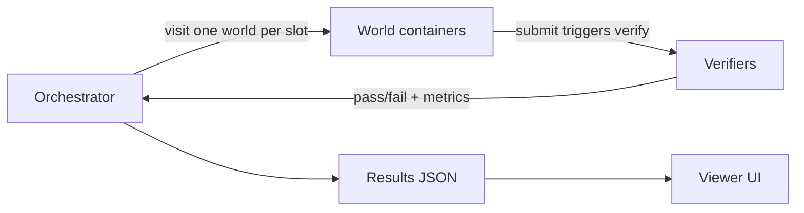

# Vision: World Hop Benchmark

World Hop Benchmark is an **eval gym for tool-using agents**: isolated Docker worlds, MCP tool access, and deterministic verifiers that score outcomes without an LLM judge.

## Problem

Tool-using agents need evaluation that matches how they are deployed in production. A single chat transcript or one-shot benchmark cannot answer whether a model can discover context, use tools correctly, and finish tasks across **multiple isolated environments**. Those environments must be resettable, inspectable, and scored against **ground truth** so results are reproducible in CI, comparable across models, and exportable as training data.

## World-hop thesis

The benchmark encodes a deliberate constraint: **partial observability with forced context switches**.

Each run assigns one unique task per world container. The agent connects to **one world at a time** via HTTP MCP, works the assigned problem, submits a verified solution, then **hops** to the next world in a seeded visit order. It cannot browse the host repo, pick tasks, or carry full state between worlds—only what it learned and wrote inside each sandbox.

That models real agent workloads: short-lived sandboxes, tool loops, and memory pressure from switching contexts. Success depends on exploration, tool discipline, and task completion under slot and bench time caps—not on memorizing a single environment layout.

## Verifiers, not LLM-as-judge

Scoring is **deterministic**. Each task declares a verifier in its pack manifest; the world runs it when the agent calls `submit`. There is no model-in-the-loop rubric.

Supported verifier types include:

- `**command`** — run a shell check (exit code is ground truth)
- `**fileContains**` — assert expected content on disk under `/world`
- `**jsonMatch**` — parse the submit payload and compare to expected fields

Maze and other packs may add specialized verifiers (path simulation, interactive exit checks). The contract is the same: binary pass/fail from executable checks, suitable for regression gates and automated sweeps.

See [task pack format](../README.md#task-pack-format) in the README and `[packages/world/src/verifiers.ts](../packages/world/src/verifiers.ts)` for the implementation.

## Who runs it

| Audience                        | Use                                                                                                                                                            |
| ------------------------------- | -------------------------------------------------------------------------------------------------------------------------------------------------------------- |
| **CI regression**               | Run a fixed config on every change; fail the pipeline when solve rate or latency regresses against a baseline.                                                 |
| **Model comparison**            | Sweep models and seeds with `[npm run compare:models](../README.md#multi-model-comparison-detail)`; summarize in [MODEL_COMPARISON.md](./MODEL_COMPARISON.md). |
| **Trajectory / dataset export** | Persist per-slot metrics, MCP activity, and outcomes in results JSON; export JSONL via `[export:trajectories](./TRAJECTORIES.md)`.                             |

The viewer at [http://localhost:5173](http://localhost:5173) is the control surface for ad-hoc runs, live monitoring, and browsing past results.

## Metric correctness

Aggregate metrics must stay consistent while a run is in flight. Rebuilding slot-derived totals on every hop used to drop per-world solve snapshots; `[rebuildAggregates](../packages/orchestrator/src/results.ts)` now recomputes slot statistics from the current visit list while **merging** the previous `uniqueSolvedByWorld` map. `[reconcileTasksSolved](../packages/orchestrator/src/results.ts)` then aligns `tasksSolved` and `solveRate` with the configured world→task assignments. Live viewer updates and final JSON therefore report the same solve rate the bench actually achieved.

## Future direction

This repository is the **Tier A high-fidelity eval harness** today: one Cursor SDK agent, sequential world visits, Docker isolation. The longer-term gym architecture—parallel rollouts, OpenEnv-compatible APIs, vectorized training tiers, and parametric task generation—is described in [RL_GYM_DESIGN.md](./RL_GYM_DESIGN.md). That document is the design north star; this repo remains the concrete reference implementation and comparison bench.